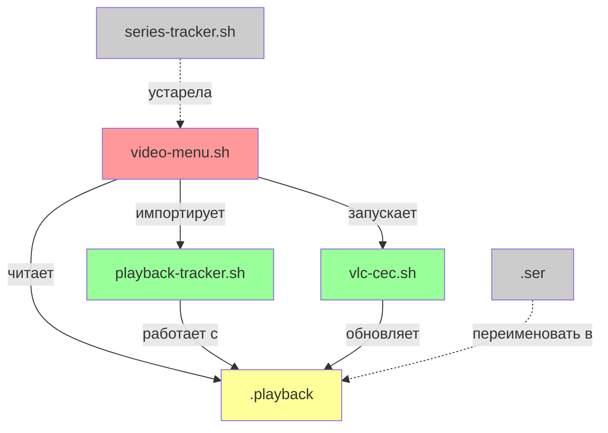

# Отчёт по проекту VLC Media Player
**Дата:** 27.11.2025, 17:45  
**Задача:** Анализ текущего состояния проекта и выявление ошибок

---

## 📋 Оглавление
1. [Обзор файлов](#обзор-файлов)
2. [Выявленные ошибки](#выявленные-ошибки)
3. [Несоответствия и технический долг](#несоответствия-и-технический-долг)
4. [Рекомендации](#рекомендации)

---

## Обзор файлов

### 1. `vlc-cec.sh` (332 строки, 11KB)
**Назначение:** Основной скрипт для запуска VLC с поддержкой CEC (Consumer Electronics Control) управления через пульт телевизора.

**Функциональность:**
- Запуск VLC с RC (Remote Control) интерфейсом на порту 4212
- Мониторинг CEC устройства `/dev/cec1`
- Обработка команд с пульта: Play/Pause, перемотка (±10, ±30, ±60 сек), навигация по процентам (0-9 = 0%-90%)
- Переключение аудиодорожек (RED кнопка) и субтитров (GREEN кнопка) Не работает корректно. Потом исправим.
- Регулировка громкости (YELLOW/BLUE кнопки) Переделаем на другую функцию. Потом исправим.
- Информация о времени воспроизведения (INFO кнопка)
- Выход в меню (BACK кнопка)

**Статус:** ✅ РАБОТАЕТ КОРРЕКТНО  
**Замечания:** Скрипт стабильный, без явных ошибок. Хорошо структурирован.

---

### 2. `video-menu.sh` (194 строки, 8.2KB)
**Назначение:** Файловый менеджер для выбора и запуска видео с поддержкой индикаторов просмотра.

**Функциональность:**
- Навигация по директориям с использованием `dialog`
- Отображение видеофайлов (avi, mp4, mkv, mov, wmv, flv)
- Индикаторы статуса просмотра: `[ ]` не просмотрено, `[T]` частично, `[X]` просмотрено
- Возврат курсора на папку при навигации вверх (`..`)
- Возврат курсора на видео после просмотра
- Загрузка сохранённой позиции воспроизведения. Будем делать когда починим и исправим video-menu.sh

**Статус:** ❌ НЕ РАБОТАЕТ - СИНТАКСИЧЕСКАЯ ОШИБКА

---

### 3. `series-tracker.sh` (197 строк, 6.4KB)
**Назначение:** Библиотека для отслеживания прогресса просмотра.

**Функциональность:**
- Определение сериалов по паттерну `S##E##` Уходим от сериалов и используем только видеофайлы
- Загрузка/сохранение прогресса в файлы `.playback`
- Вычисление иконок статуса на основе процента просмотра
- Пороги: 99% равно для `[X]`, 1% или больше для `[T]`

**Статус:** ⚠️ УСТАРЕВШАЯ ЛОГИКА  
**Проблема:** Проверяет только сериальные файлы (`is_series_file`), но требуется работа со ВСЕМИ видеофайлами.

---

### 4. `playback-tracker.sh` (191 строка, 6.3KB)
**Назначение:** Обновлённая версия библиотеки отслеживания для всех видеофайлов.

**Функциональность:**
- Аналогична `series-tracker.sh`, но функция `get_status_icon` УЖЕ исправлена - убрана проверка `is_series_file`
- Работает с файлами `.ser` (в будущем `.playback`)

**Статус:** ✅ ГОТОВА К ИСПОЛЬЗОВАНИЮ  
**Замечание:** Файл НЕ используется в текущем `video-menu.sh`.

---

### 5. `.ser_RELIS` (9 строк, 788 байт)
**Назначение:** Файл с данными о прогрессе просмотра (пример/бэкап).

**Формат записи:**
```
filename:seconds:total:percent:timestamp
```

**Пример:**
```
Guillermo.del.Toros.Cabinet.of.Curiosities.S01.E01.Rus.Eng.by.Сибиряк.avi:2673:2700:99:1732567890
```

**Статус:** ✅ КОРРЕКТНЫЙ ФОРМАТ  
**Замечание:** Файл должен быть переименован в `.playback` (будущее изменение).

---

## Выявленные ошибки

### ❌ ОШИБКА #1: Синтаксическая ошибка в `video-menu.sh`
**Файл:** `video-menu.sh`  
**Строки:** 62-64  
**Описание:**
```bash
# Строка 62-64 (НЕПРАВИЛЬНО):
    display_name="${icon_char}]${first_char}${rest_chars}"
    fi
fi
```

Лишний `fi` на строке 63, который закрывает несуществующий блок `if`.

**Ошибка при запуске:**
```
./video-menu.sh: line 64: syntax error near unexpected token `fi'
```

**Причина:** Пользователь удалил цветовые коды `\\Z4`, `\\Z1`, но случайно оставил лишний `fi`.

**Решение:**
```bash
# Правильный вариант:
    display_name="\\Z4[${icon_char}]\\Zn \\Z1${first_char}\\Zn${rest_chars}"
fi
```

Или без цветов (если требуется):
```bash
    display_name="[${icon_char}] ${first_char}${rest_chars}"
fi
```

**Приоритет:** 🔴 КРИТИЧЕСКИЙ - скрипт не запускается.

---

### ⚠️ ОШИБКА #2: Импорт устаревшей библиотеки
**Файл:** `video-menu.sh`  
**Строка:** 9  
**Описание:**
```bash
source "$SCRIPT_DIR/series-tracker.sh"
```

Используется `series-tracker.sh`, которая проверяет только сериальные файлы в функции `get_status_icon`.

**Проблема:** Требуется отображение статусов для ВСЕХ видеофайлов, а не только сериалов.

**Решение:**
```bash
source "$SCRIPT_DIR/playback-tracker.sh"
```

**Приоритет:** 🟡 ВЫСОКИЙ - функциональность работает некорректно.

---

### ⚠️ ОШИБКА #3: Проверка на сериальность при запуске видео
**Файл:** `video-menu.sh`  
**Строка:** 152  
**Описание:**
```bash
# Проверяем есть ли сохранённая позиция для сериала
if is_series_file "$clean_choice"; then
    local progress=$(load_progress "$current_dir" "$clean_choice")
    ...
```

Загрузка сохранённой позиции работает только для сериалов.

**Проблема:** Все видеофайлы должны поддерживать сохранение/загрузку позиции.

**Решение:**
```bash
# Проверяем есть ли сохранённая позиция для любого видеофайла
local progress=$(load_progress "$current_dir" "$clean_choice")
if [ -n "$progress" ]; then
    # Запуск с сохранённой позиции
    ...
else
    # Запуск с начала
    "$VLC_SCRIPT" "$current_dir/$clean_choice"
fi
```

**Приоритет:** 🟡 ВЫСОКИЙ - ограничивает функциональность.

---

### ⚠️ ОШИБКА #4: Отсутствие цветов в меню
**Файл:** `video-menu.sh`  
**Строка:** 62  
**Описание:**
```bash
display_name="${icon_char}]${first_char}${rest_chars}"
```

Отсутствуют цветовые коды для `dialog`:
- Скобки `[` `]` и буква статуса должны быть синими (`\Z4`)
- Первая буква названия должна быть красной (`\Z1`) для быстрого поиска

**Решение:**
```bash
display_name="\\Z4[${icon_char}]\\Zn \\Z1${first_char}\\Zn${rest_chars}"
```

**Формат:**
- `\\Z4` - синий цвет
- `\\Z1` - красный цвет
- `\\Zn` - сброс цвета

**Приоритет:** 🟢 СРЕДНИЙ - влияет на UX, но не на функциональность.

---

## Несоответствия и технический долг

### 1. Устаревшие комментарии
**Проблема:** Во многих файлах комментарии ссылаются на "сериалы" и `.ser` файлы, хотя система должна работать со ВСЕМИ видеофайлами.

**Примеры:**
- `series-tracker.sh`, строка 2: `# Библиотека для отслеживания прогресса просмотра сериалов`
- `playback-tracker.sh`, строка 2: `# Библиотека для отслеживания прогресса просмотра сериалов`
- `video-menu.sh`, строка 7: `# Подключаем библиотеку отслеживания сериалов`

**Решение:** Обновить комментарии:
```bash
# Библиотека для отслеживания прогресса просмотра видеофайлов
```

---

### 2. Устаревшие названия функций
**Проблема:** Функция `get_ser_file` возвращает путь к `.ser` файлу, но планируется переименование в `.playback`.

**Текущий код:**
```bash
get_ser_file() {
    local dir="$1"
    echo "$dir/.ser"
}
```

**Рекомендация:** Переименовать в `get_playback_file`:
```bash
get_playback_file() {
    local dir="$1"
    echo "$dir/.playback"
}
```

И обновить все вызовы.

---

### 3. Функции для сериалов без применения
**Проблема:** Функции `is_series_file` и `get_episode_code` более не используются, так как система работает со всеми видеофайлами.

**Рекомендация:** 
- Оставить функции для обратной совместимости (на случай, если понадобятся)
- Добавить комментарий `# DEPRECATED - больше не используется`
- Или удалить их для упрощения кода

---

### 4. Отладочный вывод
**Проблема:** В `video-menu.sh` на строке 104 есть отладочная строка:
```bash
echo "DEBUG: Вычисленная ширина окна: $max_width"
```

**Рекомендация:** Удалить или закомментировать для продакшена.

---

## Рекомендации

### Немедленные действия (критические)
1. ✅ Исправить синтаксическую ошибку в `video-menu.sh` (строка 62-64)
2. ✅ Изменить импорт с `series-tracker.sh` на `playback-tracker.sh`
3. ✅ Убрать проверку `is_series_file` при загрузке позиции (строка 152)

### Улучшения UX (высокий приоритет)
4. ✅ Добавить цветовые коды в `display_name` для улучшения визуального восприятия
5. ⏳ Удалить отладочный вывод (строка 104)

### Рефакторинг (средний приоритет)
6. ⏳ Переименовать `.ser` → `.playback` и обновить функции
7. ⏳ Обновить комментарии (убрать упоминания "сериалов")
8. ⏳ Пометить или удалить неиспользуемые функции (`is_series_file`, `get_episode_code`)

### Тестирование
9. ⏳ Протестировать все 4 UX фикса после исправления ошибок:
   - Цвет скобок `[` `]` - оба синие
   - Первая буква filename - красная (быстрый поиск)
   - Курсор при `..` - возврат на папку
   - Курсор после видео - возврат на файл

---

## Итоговая схема изменений



**Легенда:**
- 🔴 Красный - требует исправления
- 🟢 Зелёный - готов к использованию
- 🟡 Жёлтый - требует обновления
- ⚪ Серый - устаревший/не используется

---

## Заключение

Проект находится в состоянии активной разработки. Основная проблема - **синтаксическая ошибка в `video-menu.sh`**, которая блокирует запуск. После её исправления необходимо переключиться с `series-tracker.sh` на `playback-tracker.sh` для поддержки отслеживания всех видеофайлов, а не только сериалов.

**Время на исправление критических ошибок:** ~10-15 минут  
**Риски:** Минимальные, все изменения локальные и обратимые
